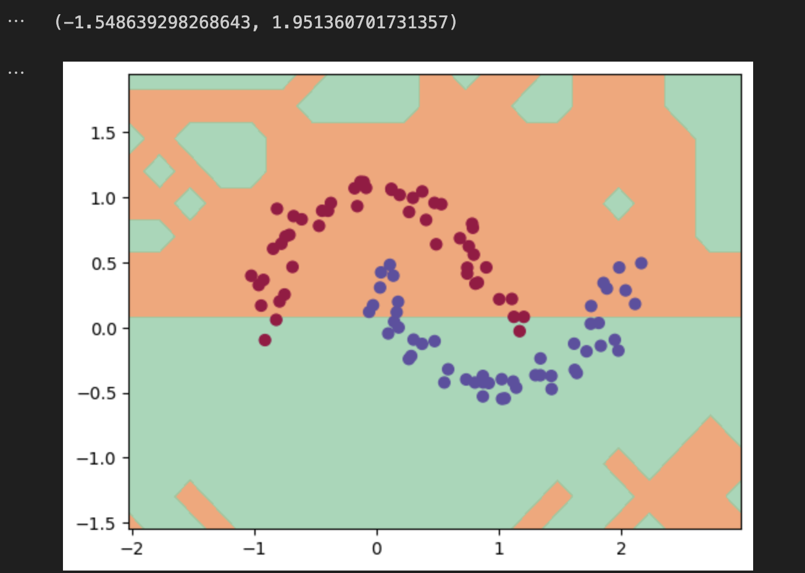

# DeepTensor


- DeepTensor: A minimal deep learning library focused on custom autograd and efficient tensor operations.

---

## Installation

```bash
pip install deeptensor
```

---

## Checkout Demo

- [play with demo](./demo/main.ipynb)



---

## Check Docs

- [visit docs](https://deependujha.github.io/deeptensor)

---

## WIP

- Save & Load model
- Train MNIST model
- Train a character-level transformer model
- Add support for DDP
- Add support for CUDA execution

---

## To be done later

- Add support for optimizers (sgd, nesterov, adam, etc)
